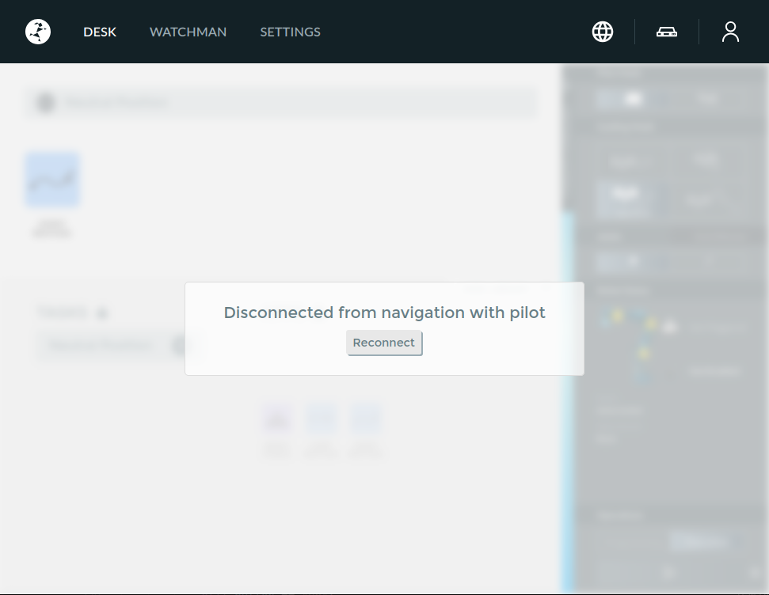

# Read franka buttons in ROS

This is a ROS repo to read the state of the buttons of franka robot.

- [Read franka buttons in ROS](#read-franka-buttons-in-ros)
  - [Installation](#installation)
    - [Preparing the virtual environment](#preparing-the-virtual-environment)
    - [Install Python dependencies](#install-python-dependencies)
    - [Build the workspace](#build-the-workspace)
  - [Configuring Franka Desk credentials](#configuring-franka-desk-credentials)
  - [Running the node](#running-the-node)
    - [Franka Desk access](#franka-desk-access)
    - [Node configuration](#node-configuration)
    - [Button events](#button-events)
  - [A note about versions](#a-note-about-versions)
  - [Acknowledgments](#acknowledgments)
  - [Maintainer](#maintainer)
  - [License](#license)

## Installation

Clone this repository to your ROS 2 workspace's `src/` folder.

```bash
cd ~/<your_ws>/src
git clone https://github.com/jellehierck/franka_buttons_ros2
```

### Preparing the virtual environment

The following steps allow you to install the additional dependencies to a virtual environment and run ROS from that environment. This is highly recommended to not pollute the global installation of Python, especially since we require some dependencies of different versions than are included in e.g. Ubuntu 22 (for ROS Humble) by default.

Install `python3-venv` in the global Python interpreter to be able to make a virtual environment:

```bash
sudo apt install python3-venv
```

In your workspace folder, source ROS to obtain links to the ROS system packages and create a virtual environment which includes all ROS packages. Also add a `COLCON_IGNORE` file to the virtual environment folder to prevent `colcon` from trying to build the `.venv` contents.

```bash
cd ~/<your_ws>
source /opt/ros/humble/setup.bash
python3 -m venv .venv --system-site-packages --symlinks
touch .venv/COLCON_IGNORE
```

### Install Python dependencies

Install Python dependencies in the virtual environment using one of the following options:

```bash
cd ~/<your_ws>
source .venv/bin/activate

# From a specific requirements.txt file
pip3 install -r src/franka_buttons_ros2/franka_buttons/requirements.txt

# OR install packages directly
pip3 install package1 package2

# OR traverse the workspace source folder to find all requirements files (source: https://stackoverflow.com/a/67062234)
find ./src -name "requirement*.txt" -type f -exec pip3 install -r '{}' ';'
```

### Build the workspace

Build the workspace **with the virtual environment sourced** and **using `python -m colcon ...`**. This ensures that the workspace is built using the packages in the virtual environment instead of the global `colcon` (source: <https://github.com/ros2/ros2/issues/1094#issuecomment-1503725544>).

```bash
cd ~/<your_ws>
source .venv/bin/activate
python -m colcon build --symlink-install --packages-up-to franka_buttons
```

## Configuring Franka Desk credentials

To connect to the pilot buttons, we need to connect to the Franka Desk using a username and password. The following steps explain how to configure them:

Copy the `.env` template to the `~/.ros/franka_buttons/credentials` directory. `franka_pilot_buttons` expects them here by default. You can also choose another location, but you have to [define the `credentials_filepath` parameter](#node-configuration).

```bash
cd ~/<your_ws>/src/franka_buttons_ros2
mkdir -p ~/.ros/franka_buttons/credentials
cp -i .env.template ~/.ros/franka_buttons/credentials/.env
```

Add your credentials to the copied file:

```bash
nano ~/.ros/franka_buttons/credentials/.env
```

## Running the node

Source the built files and run the nodes using the virtual environment. **Order matters! Source the built workspace first, and then the virtual environment.**:

```bash
cd ~/<your_ws>

# Source the workspace and virual environment. Order matters!
source install/setup.bash
source .venv/bin/activate

ros2 run franka_buttons franka_pilot_buttons --ros-args -p hostname:=<robot-ip>
```

You can also include this node into a launch file with the following snippet:

```python
from launch_ros.actions import Node
from launch import LaunchDescription

def generate_launch_description() -> LaunchDescription:
    ...
    return LaunchDescription([
      ...
      # Franka buttons node
      Node(
         package="franka_buttons",
         executable="franka_pilot_buttons",
         parameters=[
            {
               # Required parameters
                  "hostname": "<robot-ip>",
                  # Optional parameters
                  "credentials_filepath": "path/to/credentials/.env",
                  "request_timeout": 2.0,
            }
         ],
      ),
      ...
    ])
```

### Franka Desk access

Once the `franka_pilot_buttons` node logs in to the Desk, it will automatically take control of the robot and cause the Desk dashboard in the browser to disconnect as shown below.

Note: When the browser dashboard reconnects to the robot (e.g. by pressing the `Reconnect` button or refreshing the page), the `franka_pilot_buttons` node will shut down.



### Node configuration

The `franka_pilot_buttons` has some important parameters:

- `hostname`: (string, required) The hostname of the Franka Control Box to connect to the Franka Desk.
- `credentials_filepath`: (string) Where to find the Franka Desk login credentials. Defaults to `~/.ros/franka_buttons/credentials/.env`. Make sure to [configure the credentials](#configuring-franka-desk-credentials).
- `request_timeout`: (float) Timeout for Franka Desk requests in seconds. Defaults to `2.0`.

### Button events

When a button is pressed, it is captured by `franka_pilot_buttons` and a `franka_buttons_interfaces/msg/FrankaPilotButtonEvent` message is published with that button's field set to `"PRESSED"`. When the button is held, the message is re-sent a few times per second. When the button is released, a final message is sent with that button's field set to `"RELEASED"`. If multiple buttons are pressed or released simultaneously, they are combined within a single `FrankaPilotButtonEvent` message. If no buttons are pressed, no messages are published.

There are eight buttons on the Franka Research 3 robot:

- Arrow keys (important: these buttons are *not captured* when FCI is enabled):
  - `up`
  - `down`
  - `left`
  - `right`
- Action buttons:
  - `cross` (also called Delete)
  - `check` (also called Confirm)
  - `circle` (also called Teach)
- And finally the `pilot` button, which is not captured by `franka_pilot_buttons`


## A note about versions

This code is currently only tested with the following versions:

- Ubuntu 22.04 with ROS 2 Humble
- `libfranka` version 0.13.6
- Robot System Version 5.6.0

If you find this code working or not working with other versions, please open an issue to let me know!

## Acknowledgments

This code is heavily inspired by [Giovanni Franzese's `franka_buttons`](https://github.com/franzesegiovanni/franka_buttons) package for ROS 1.

The original `franka_buttons` package was in turn heavily inspired by [Jean Elsner's `panda-py`](https://github.com/franzesegiovanni/franka_buttons) package.

If you end up using this code in published research, please consider citing the [original `panda-py` software paper](https://github.com/JeanElsner/panda-py?tab=readme-ov-file#citation).

## Maintainer

Jelle Hierck (<j.j.hierck@student.utwente.nl>)

## License

The code in this package is subject to the [MIT license](https://opensource.org/license/mit).
